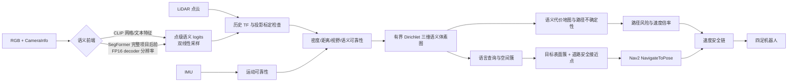

# 面向四足机器人自然语言目标导航的可靠性加权三维语义建图与不确定性感知主动规划研究

## 开题报告初稿

**研究类型：** 算法系统型研究 / 机器人视觉与导航

**研究对象：** 搭载 LiDAR、RGB 相机和 IMU 的四足移动机器人

**项目依据：** 本报告基于 `semantic_mapping` 当前源码、README、项目状态和运行手册整理，代码状态截至 2026-08-09。文中"已实现/已验证"仅指项目材料中有对应代码或运行记录；"拟"与"待验证"指论文阶段计划，不代表已经取得实验结果。
**本轮更新（2026-08-11）：** 已将 SegFormer 语义前端从"先 argmax 再映射"升级为"项目类别概率保真聚合"。新增 `semantic_posterior.py`（损失最小化传输、FP16 原子后验图、投影点双线性采样），`segformer_core.py` 新增 `aggregate_project_probability_tensor`（GPU 端多对一标签映射的概率求和）。`segformer_node.py` 新增 decoder 分辨率温度缩放后验 + `/segformer/project_posterior` 话题发布。`ga_bsvm_node.py` 新增 `segformer_posterior_sync_callback`（Header 校验 + 双线性采样后验 + logits 转换），旧版 argmax 路径作为 `segformer_use_full_posterior=false` 回归基线保留。新增 `test_semantic_posterior.py` 覆盖概率聚合、FP16 round-trip、双线性采样和 Header 校验共 9 项测试。

---

## 摘要

四足机器人在非结构化或半结构化环境中执行"寻找红色汽车""前往电动自行车"等自然语言目标时，需要同时解决语义理解、三维定位、可通行性判断和运动安全控制问题。单帧图像识别只能回答目标是否可能出现在当前视野内，难以提供稳定的三维位置；传统几何导航又通常不使用语义类别和语义置信度，因而可能将目标表面中心误作为导航终点，或者在感知不可靠时仍以较高速度运行。现有项目已形成从 FAST-LIO 定位与点云输入、SegFormer 语义前端、LiDAR–相机投影、可靠性加权三维体素融合、自然语言查询、语义代价地图到 Nav2 控制接口的可运行原型，并按 SegFormer-first 架构完成了概率链路重构。

本研究拟围绕"如何在受限算力和异步多源感知条件下，保真传递并校准 SegFormer 的任务空间类别后验，并将其可靠地落到四足机器人的可执行导航目标上"这一核心问题，构建一套可解释、可拒绝、可逐级验证的三维语义导航方法。方法以 SegFormer-B0 为主语义前端，在 decoder 分辨率上对原始 logits 做温度缩放 softmax，再以项目类别概率聚合将多对一标签映射保留为完整后验，通过 FP16 原子消息带 Header 时间戳传入三维融合节点；融合节点在对 LiDAR 投影点做双线性采样后直接获得无偏 logits，不再重构伪均匀类别分布。以运动状态、点云局部密度、测距、图像边缘位置和语义熵组成观测可靠性，以有界证据更新的 Dirichlet 类别分布建立三维语义体素图；在查询阶段，将类别证据、空间聚类和颜色支持率结合，输出"目标表面簇位置"与"安全接近点"两个不同位姿；在控制阶段，将局部路径上的语义不确定度转换为具有指数滑动平均和时间速率限制的速度倍率。CLIP 开放词汇能力作为查询触发的异步旁路，仅在闭集未知词条时按需运行，不进入主安全链路。

研究将采用"二维识别—三维融合—仿真导航—实机静态与受控运动"的分层验证策略，使用 CARLA 共享真值数据、M2DGR 数据、Gazebo 可控场景和 Lite3 传感器 Bag，分别评价语义识别、目标定位、接近点安全性、导航成功率、碰撞/失败进度、实时性和不确定性校准。预期形成一套面向四足机器人语义导航的可靠性建图与安全决策方法，并明确其在开放词汇、动态目标、实例分割、标定误差和真实运动接口方面的适用边界。

**关键词：** 四足机器人；自然语言目标导航；三维语义建图；SegFormer；概率保真；Dirichlet 证据融合；不确定性校准；主动感知

## 1. 研究背景与意义

### 1.1 研究背景

机器人导航正在从"到达给定坐标"转向"理解人类目标并到达可执行位置"。对于四足机器人而言，户外道路、停车场和校园等场景同时具有以下特征：目标类别长尾、光照与遮挡变化明显、LiDAR 与相机采样频率不同、机器人运动会影响观测质量，且目标物体的几何中心通常不是机器人应到达的位置。例如，机器人接近汽车时，需要到达车辆外侧且可通行的道路区域，而不是穿入车辆占据的体积；当语义图在路径前方证据不足时，系统还应降低速度或拒绝发布目标，而不是把低置信度预测直接转化为运动指令。

项目当前使用 FAST-LIO 提供定位与点云前端，`segformer_node.py` 提供 SegFormer-B0 主语义前端并发布 decoder 分辨率 FP16 项目后验图，`semantic_posterior.py` 提供概率聚合、双线性采样和 logits 转换，`clip_node.py` 作为可选开放词汇旁路，`ga_bsvm_node.py` 完成投影、证据融合、查询和语义代价地图，`active_perception_node.py` 完成路径不确定度到速度倍率的转换，`nav_goal_bridge_node.py` 将 `/goal_pose` 转为 Nav2 `NavigateToPose` action。这个组成说明研究问题已经从单个感知模型扩展为"语义感知—三维地图—目标决策—局部控制"的系统问题。

### 1.2 研究意义

**理论与方法意义。** 研究将语义分类概率、观测可靠性、空间聚类和可通行性约束置于同一三维地图决策链中，考察感知不确定性如何影响目标选择与速度控制。这有助于避免把“识别分数高”直接等同于“可以安全导航”，并为语义地图与经典几何导航之间建立可解释接口。

**工程意义。** 四足机器人对机身、腿部扫掠范围、足端碰撞和速度变化更敏感。项目中已经将目标表面位置与接近点分离、使用包含腿部扫掠的 footprint、保留单一最终速度写入者，并为 Lite3 配置了投影标定失败关闭和无安全桥不下发底盘命令的门禁。研究这些约束的作用，有助于形成可迁移到不同机器人平台的安全工程流程。

**应用意义。** 若系统能够在不为每一种自然语言目标重新训练检测器的情况下，利用开放词汇检索处理长尾目标，同时在闭集安全类别上保持稳定的道路/障碍分割，就可以支持巡检、校园服务、园区配送和户外目标搜寻等任务。需要强调的是，本研究首先追求“可验证的目标落地与安全拒绝”，而不是宣称解决任意语言指令、任意动态目标或完全自主实机部署。

## 2. 国内外研究现状与问题分析

### 2.1 语义建图与三维语义融合

SemanticFusion 将图像语义预测与稠密三维地图关联，并在多视角观测之间概率融合类别分布，说明二维语义可以被提升为稳定的三维语义表示。[1] Kimera 进一步提供了实时度量—语义定位与建图系统，将几何估计、语义重建和机器人系统集成在统一框架中。[2] 面向城市自动驾驶的概率语义建图工作则将二维分割结果与点云地图关联，并通过概率模型生成鸟瞰语义地图。[3]

这些工作为本项目提供了两个重要基础：第一，语义地图不应只保存一个硬标签，而应保留跨帧观测累积后的类别分布；第二，语义融合必须依赖可靠的几何位姿、坐标变换和时间同步。现有项目的 `VoxelMap` 沿用这一思想，但使用的是离散类别 Dirichlet 证据、单帧证据上限、总证据上限和时间衰减，并额外融合 CLIP 特征与颜色属性。其尚未完成的关键工作是：定量证明不同可靠性因素和证据上限确实改善了地图质量，而不是只增加了系统复杂度。

### 2.2 开放词汇视觉语义与语言地图

CLIP 通过大规模图文对比学习建立图像—文本共同表示，支持使用自然语言引用视觉概念，而不必为每个类别单独收集监督数据。[4] SegFormer 采用分层 Transformer 编码器和轻量 MLP 解码器，在语义分割中兼顾多尺度表征与计算效率。[5] 这两类模型分别代表了本项目中的两条路线：CLIP 适合开放词汇检索，但项目代码采用图像网格，空间分辨率有限；SegFormer 适合道路与交通参与者的逐像素闭集分割，但实际可识别类别受 checkpoint 的 `id2label` 限制，标准 Cityscapes 权重并不包含 `electric_bicycle`。

近年来的 VLMaps、ConceptFusion 和 OpenScene 将视觉语言特征与三维重建或三维点特征对齐，使自然语言可以直接索引三维空间。[6–8] 这些工作说明"语言特征进入三维地图"是可行方向，但本项目的研究重点有所不同：不是只构建可检索的开放词汇地图，而是研究在四足机器人实时运动中，如何将语言检索结果经过类别证据、空间簇、道路支持、碰撞净空和机器人同侧约束，转成 Nav2 能够执行或拒绝的目标。换言之，研究关注的是从"语义匹配"到"安全可执行目标"的中间决策层。

在此基础上，本项目进一步研究了语义前端概率信息如何保真地传输到三维导航链。标准 Cityscapes 权重存在明显的多对一标签映射（例如 `road` 和 `sidewalk` 都映射到导航本体中的 `road`），传统的"先 argmax 再映射"会丢失同映射类的概率质量。本项目的 SegFormer 路线现已采用温度缩放后验 + 项目类别概率聚合 + FP16 decoder 分辨率传输 + LiDAR 投影点双线性采样，在不增加主干网络计算的前提下保留了完整的类别竞争关系。这一设计回应了语义分割置信度校准的最新研究动向，并将计算约束（Lite3 Xavier NX 的 CUDA/FP16 可用性）和时序正确性要求（原子 Header 校验而非`Float32MultiArray` 缓存）作为导航链路的第一类设计约束。

### 2.3 不确定性估计与主动感知

贝叶斯深度学习研究区分了观测噪声导致的 aleatoric uncertainty 与模型/知识不足导致的 epistemic uncertainty，并讨论了将不确定性用于视觉任务的必要性。[9] Evidential Deep Learning 进一步使用 Dirichlet 分布表示多类别证据，使模型能够表达“证据不足”而不是被迫选择某一个类别。[10] 在主动探索方面，Active Neural SLAM 将建图、规划和探索策略模块化，说明主动感知可以通过层次化结构与经典规划器结合，而不必完全依赖端到端策略。[11]

当前项目将体素预测熵和证据总量构成一个融合不确定度，并在局部路径上计算均值与高分位数，再通过速度倍率门控影响执行速度。这一设计具有可解释性，但仍有三个待研究问题：其不确定度是否与目标定位错误、路径风险或导航失败相关；均值与高分位数的组合是否比单一均值更能暴露局部高风险；速度降低后带来的安全收益是否值得其时间成本。

### 2.4 现有研究与本项目的差距

基于上述文献和当前代码，可以将研究缺口概括为四点：

1. 许多方法分别优化语义识别、三维建图或语言导航，较少在同一验证协议中同时评价“目标定位—安全接近—局部控制”的闭环链路。
2. 开放词汇特征能够提高查询灵活性，但不天然保证类别可靠性、颜色属性一致性或目标实例完整性；项目已有空间簇和簇级颜色支持率机制，需要通过对照实验验证其作用。
3. 语义地图中的不确定度通常停留在可视化或规划代价层，尚未充分回答如何把不确定度转换为四足机器人的速度和拒绝策略，并保持局部运动曲率不被破坏。
4. 从仿真到 Lite3 的主要瓶颈并非只在模型精度，还包括 CameraInfo、LiDAR–相机外参、历史 TF、单一里程计权威源、原子时间戳消息和底盘安全桥。若这些条件未满足，不能把静态算法烟测结果表述为实机导航成功。

本报告不将“国内尚无相关研究”作为结论。当前文献清单以可核验的英文原始论文为主，正式提交前应按学校要求补充 CNKI、万方或学校数据库中的中文文献，并使用同一研究问题和纳入标准进行筛选。

## 3. 科学问题、研究目标与研究假设

### 3.1 核心科学问题

在 LiDAR、RGB 相机和 IMU 异步采样、机器人运动会改变观测质量、语义前端存在开放/闭集差异且目标附近可通行区域不确定的条件下，如何把自然语言目标稳定地映射为三维目标表面簇和安全接近点，并利用同一份不确定性表示调节机器人速度，从而在保持实时性的同时降低错误目标与危险导航行为？

### 3.2 总体目标

构建并验证一套面向四足机器人的自然语言目标导航系统，使其能够：

1. 以 SegFormer-B0 为主前端，在 decoder 分辨率上完成温度缩放、项目类别概率聚合和 FP16 原子后验传输，将完整类别后验保真地传入三维证据融合；
2. 将语义、几何、运动和观测质量信息融合到带类别分布、特征和颜色属性的三维体素图；
3. 从自然语言查询中区分目标位置与安全接近位置，并在证据不足、无道路支持或路径净空不足时输出可解释拒绝原因；
4. 将局部路径不确定性转化为有界速度调节，降低高风险区域的运行速度且不改变已由局部规划器检查的运动曲率；可选地通过单步信息增益视点选择实现主动观测；
5. 形成从 CARLA 二维识别、M2DGR 三维感知、Gazebo 闭环导航到 Lite3 受控迁移的可重复评价流程。

### 3.3 研究问题与待检验假设

**RQ1：** 在相同 SegFormer-B0 主干和推理预算下，项目类别概率先聚合再校准，是否比"原始 argmax 映射 + 最大置信度重构"产生更准确、校准更好且更适合三维累积的语义后验？

**H1：** 概率先聚合将减少多对一标签映射错误（如 `road/sidewalk` 的信息损失）；温度校准将降低 NLL/Brier/ECE，并在固定错误风险下提高可接受像素和目标簇覆盖率。

**RQ2：** 类别证据/CLIP 相似度、簇级颜色支持率、目标尺寸约束和空间聚类的组合，是否能提高自然语言目标定位的准确性，并减少局部附件导致的错误目标选择？

**H2：** 相比“最大相似度体素”或“单体素颜色筛选”，完整空间簇的证据和颜色支持率将减少 `white headlight`、车牌、轮毂等局部区域引起的属性误判。

**RQ3：** 对障碍物目标加入道路邻域、机器人同侧、直线路径净空和足式机器人 footprint 约束，是否能减少目标另一侧接近、沿车身擦行和目标中心穿越等危险目标？

**H3：** 安全接近点策略的主要收益应体现在安全接近率、最小障碍间距、规划失败率和碰撞率，而不是单纯的目标中心定位误差；其可能增加路径长度，因此需要同时报告效率代价。

**RQ4：** 将路径不确定性转换为带平滑和速率限制的速度倍率，是否能在不显著损害到达时间的情况下减少碰撞、无有效轨迹和失败进度？

**H4：** 主动感知速度门控将在高不确定度路径段降低速度并减少安全事件，但可能增加任务时间；该权衡需要通过配对场景、相同 Nav2 参数和明确的安全指标进行检验。

## 4. 研究内容

### 4.1 研究内容一：多语义前端与统一语义模式

建立统一的 13 类导航词表：`road`、`building`、`tree`、`person`、`car`、`truck`、`bus`、`bicycle`、`electric_bicycle`、`motorcycle`、`chair`、`bench` 和 `unknown background`，并统一中英文别名、颜色别名和类别代价。

**SegFormer 主路线**使用 `nvidia/segformer-b0-finetuned-cityscapes-1024-1024`，支持自定义 13 类 checkpoint。该路线已实现以下概率保真处理链：

1. 在 decoder 原生分辨率上对原始类别 logits 做温度缩放 softmax（`posterior_temperature`）；
2. 通过 `aggregate_project_probability_tensor` 在 GPU 端将原始标签概率按项目映射求和（例如 Cityscapes 的 `road` 和 `sidewalk` 概率相加），输出 B×13×H×W 项目后验张量；
3. 以 `16FC<13>` 编码打包为带源图 Header 的 FP16 `sensor_msgs/Image`，通过 `/segformer/project_posterior` 话题发布；
4. GA-BSVM 通过 `ApproximateTimeSynchronizer` 同步接收点云、后验图和源 RGB，用 `_same_image_header` 校验后验与图像的对齐，再用 `sample_posterior_bilinear` 在 LiDAR 投影坐标处采样，最后通过 `posterior_probabilities_to_logits` 转为 logits 传入 `_process_semantic_frame`。

该路线还保留了对自定义 13 类 checkpoint 的一对一映射退路：`aggregate_project_probability_tensor` 在映射为单位阵时等价于恒等变换，不会引入额外假设。

**SegFormer 旧版路线**（`segformer_use_full_posterior=false`）仅保留硬标签 + 最大置信度作为回归基线，供消融实验使用。

**CLIP 路线**作为可选的开放词汇旁路，不在 Lite3 默认配置中持续运行。当自然语言查询无法解析为闭集类别时，系统可按需触发 CLIP 文本编码生成候选特征，仅输出候选区域，最终安全验收仍由主链完成。

针对电动自行车，建立成对 RGB/单通道掩码数据格式、序列级训练/验证划分和 checkpoint 标签验收。只有当目标 IoU、`electric_bicycle` IoU 和 `road` IoU 达到预设门槛时，权重才能进入导航推理；项目当前尚无本地电动自行车像素标注，因此该部分属于待完成研究内容。

### 4.2 研究内容二：时空对齐与可靠性加权三维语义体素融合

以 FAST-LIO 输出的 LiDAR 点云和 `odom -> base_link` 位姿为几何基础，将相机语义投影到点云。投影前必须检查 CameraInfo、图像尺寸、畸变条件、LiDAR–相机外参和消息时间戳；历史 TF 不可用时，将帧放入有界重试队列或安全丢弃，禁止用最新位姿替代点云采样时刻的位姿。

对于 SegFormer 主路线，语义来源不再是单个数 argmax 硬标签和重构伪均匀分布，而是完整的项目类别后验。投影点在 SegFormer decoder 分辨率网格上通过双线性采样获得 13 维概率向量，再经 `posterior_probabilities_to_logits` 转换为无偏 logits。这意味着 `bicycle`、`electric_bicycle`、`motorcycle` 之间的真实竞争关系被完整保留并传入三维融合。

对每个投影点计算观测可靠性：

\[
r_i=r_i^{motion}r_i^{density}r_i^{range}r_i^{view}r_i^{semantic}.
\]

其中运动可靠性由 IMU 时间窗内的角速度均方根和加速度偏差决定；点密度可靠性由局部邻域点数决定；距离可靠性随测距增加而衰减；视野可靠性抑制图像边缘投影；语义可靠性由类别分布熵归一化得到。可靠性参数不是最终真理，而是需要在验证集上进行敏感性分析和阈值校准的设计变量。

对同一帧落入体素 \(v\) 的点先聚合，令 \(p_i\) 为点级类别概率、\(R_{v,t}=\min(\sum_i r_i,R_{frame})\) 为受限帧证据，体素类别参数按下式更新：

\[
\boldsymbol{\alpha}_{v,t}=\boldsymbol{\alpha}_0+
\lambda(\boldsymbol{\alpha}_{v,t-1}-\boldsymbol{\alpha}_0)+
sR_{v,t}\bar{\mathbf p}_{v,t},
\]

其中 \(\bar{\mathbf p}_{v,t}\) 为可靠性加权平均类别分布，\(\lambda\) 为证据衰减系数，\(s\) 为证据强度；体素总证据超过上限时进行归一化约束。这样可以避免同一帧中的大量相关 LiDAR 回波把置信度错误地推高。

CLIP 后端额外保存体素级归一化特征，两个后端都保存可靠性加权的 RGB 颜色。体素的不确定性定义为：

\[
U_v=\beta\frac{H(\mathbf p_v)}{\log K}+
(1-\beta)\frac{K}{\sum_k\alpha_{v,k}},
\quad
H(\mathbf p_v)=-\sum_kp_{v,k}\log p_{v,k}.
\]

这里第二项是基于证据总量的无知度代理，不应在论文中未经验证地称为严格的后验方差。查询类别概率使用去除对称先验后的观测证据分布，以减弱类别数从 6 类扩展到 13 类时先验对稀有目标分数的压低。

概率保真的影响将通过对以下两种极端情况的测试进行验证：静止场景中大量重复帧是否在完整后验 + 有界证据下仍能稳定校准（不持续推高置信度）；当原始模型第二候选是细粒度竞争类（如 `bicycle`）时，完整后验路径是否比 argmax 重构路径保留了更合理的类别歧义。

### 4.3 研究内容三：自然语言目标选择与安全接近点生成

查询解析器首先识别类别和颜色。对于闭集 SegFormer 主路线，查询必须落入实际 checkpoint 支持的类别，体素后验直接从完整项目概率导出，不再依赖重构的均匀剩余分布；对于 CLIP 旁路，系统同时利用文本—体素特征相似度和类别证据。候选体素通过最低证据、类别概率、类别主导性和相似度门控，再用 KD-tree 按空间邻域形成目标簇。目标簇评分由语义分数、证据支持度、距离和尺寸范围构成；颜色不在单体素阶段决定，而在完整簇形成后计算簇级颜色均值和支持率。

典型查询评分可写为：

\[
S_v(q)=w_f\,\mathrm{cos}(\mathbf f_v,\mathbf f_q)+
w_c\,p_v(q)+w_a\,C_v(q),
\]

其中 \(\mathbf f_v\) 和 \(\mathbf f_q\) 分别为体素与文本特征，\(p_v(q)\) 为类别证据概率，\(C_v(q)\) 为颜色匹配分数。最终目标位置为目标簇的证据加权质心，而不是最高分体素的位置。

对道路、建筑、车辆和人员等障碍类目标，系统进一步在目标附近搜索道路体素，检查：

- 目标与道路接近点之间的距离范围；
- 接近点周围是否存在语义障碍；
- 接近点是否位于机器人相对目标的同侧；
- 机器人到接近点的直线段是否满足语义净空；
- 机器人位姿、TF 和投影标定是否达到发布门槛。

系统发布 `/query_target_pose` 表示目标表面簇位置，发布 `/goal_pose` 表示碰撞感知的接近点，两个位姿不混用。找不到满足约束的道路接近点时，应拒绝发布，而不是默认导航到物体中心。

### 4.4 研究内容四：不确定性感知主动规划与速度门控

`active_perception_node` 将 `/plan` 和 `/voxel_entropy_data` 均转换到 `odom` 坐标系，在局部路径前视距离内搜索不确定性体素。路径风险使用均值和 90 分位数加权：

\[
U_{path}=(1-\gamma)\operatorname{mean}(U_v)+
\gamma\operatorname{P}_{90}(U_v).
\]

经指数滑动平均后，若路径有有效语义支持，则根据归一化风险计算目标速度倍率；若路径无地图支持，则采用更保守的未知区域倍率。倍率变化受每秒最大变化率限制，输出速度同时缩放线速度和角速度，默认保持 Nav2 DWB 已检查的弧线曲率。研究将比较不同风险统计量、时间平滑和倍率策略，验证其安全收益与时间开销。

该模块不是独立的碰撞检测器。真实碰撞安全仍由几何点云层、语义代价层、足式机器人 footprint、Nav2 局部规划器和底盘安全桥共同负责；主动感知只提供基于语义不确定性的速度调节。

当前节点只缩放已有速度命令，不改变传感器视点或目标选择。因此论文将其称为"不确定性感知速度门控"。若后续工作实现单步信息增益视点选择（对 OBSERVE 状态生成候选可达视点，以预期信息增益、路径风险和时间成本选择下一动作），则升级为主动感知。

### 4.5 研究内容五：可重复的 ROS 2 系统集成与 sim-to-real 门禁

统一 ROS 2 话题、QoS、TF 和参数配置，确保同一次实验只启动一个语义前端、一个 GA-BSVM 节点、一个主动感知节点和一个最终速度写入者。`nav_with_remap_launch.py` 负责加载 Nav2、主动感知和 action 桥，支持将 FAST-LIO 的 `/Odometry` 重写为 Nav2 读取的话题。

Lite3 迁移按“传感器采集—静态离线烟测—投影标定—受控运动 Bag—外部 Nav2 结构检查—架空/低速空场—障碍环境”的顺序进行。`projection_calibration_verified=false` 时允许生成调试语义图，但不允许发布目标位姿；在安全桥未完成前，主动感知只输出无执行端的安全话题。该门禁是研究设计的一部分，而不是可以通过降低阈值绕过的部署细节。

## 5. 研究方法与技术路线

### 5.1 研究方法

本研究采用四类方法相结合：

1. **文献分析与问题建模：** 以三维语义建图、开放词汇三维理解、不确定性估计和主动导航为主题建立文献矩阵，明确每一项设计对应的已知问题、方法假设和可检验指标。
2. **模块化系统设计：** 使用 ROS 2 节点化架构，将语义前端、融合、查询、代价地图、速度门控和 Nav2 action 作为可替换模块，保持输入输出接口一致。
3. **控制变量实验与消融实验：** 在相同数据、相同传感器时间戳、相同几何变换和相同 Nav2 参数下，只替换一个关键模块，比较完整方法与简化基线。
4. **分层验证与故障注入：** 先验证语义识别，再验证三维地图和目标点，再验证导航闭环；人为注入时间偏差、稀疏点云、图像遮挡、错误颜色局部和缺失 TF，检验系统是否输出合理拒绝而非静默失败。

### 5.2 总体技术路线

### 5.3 研究阶段与数据来源

| 阶段 | 数据/环境 | 主要目的 | 当前状态与边界 |
|---|---|---|---|
| 阶段 I：二维语义 | CARLA 0.9.16，共享 RGB、语义真值、实例真值 | CLIP/SegFormer 类别、颜色、属性和网格定位对比 | 采集与评测工具已具备；最终指标报告尚未形成 |
| 阶段 II：三维融合 | M2DGR Bag | 检查 FAST-LIO、时间同步、投影、语义体素、目标簇和接近点接口 | `car` 查询有运行记录；缺少物体真值，不用于宣称定位误差达标 |
| 阶段 III：仿真闭环 | Gazebo Go2：静态汽车、person、school parking lot | 验证目标/接近点、Nav2 action、速度门控和安全拒绝 | 手动导航与部分语义链路已验证；干净进程闭环和定量实验待完成 |
| 阶段 IV：实机迁移 | Lite3 传感器 Bag、受控运动 Bag、低速实机 | 验证传感器链路、标定、TF、实时性和安全桥 | 传感器 header 对齐已有记录；外参、唯一 TF、运动桥和导航未验收 |

### 5.4 对照组与消融设计

| 编号 | 对照/消融 | 目的 |
|---|---|---|
| B1 | CLIP + 网格最大响应 | 测量开放词汇检索基线的类别和定位能力 |
| B2 | SegFormer + 闭集类别后验 | 测量逐像素分割与道路/障碍类别基线 |
| B3 | 当前完整方法 | 作为可靠性、查询簇、安全接近和速度门控的组合方法 |
| A1 | 去除 IMU/运动可靠性 | 检验动态运动对融合质量的影响 |
| A2 | 去除点密度、距离和图像边缘权重 | 检验几何/观测质量因素的边际贡献 |
| A3 | 用硬标签或未经上限的点数累计替换 Dirichlet 更新 | 检验有界证据融合是否减少过度自信 |
| A4 | 单体素查询替代空间簇查询 | 检验簇级证据是否减少局部误检 |
| A5 | 体素级颜色过滤替代簇级颜色支持率 | 检验颜色附件误判问题 |
| A6 | 物体中心/最近点替代道路安全接近点 | 检验同侧、净空和道路约束 |
| A7 | 无主动速度门控 | 检验不确定性到运动控制的实际收益 |
| A8 | 无历史 TF 重试或使用最新 TF替代 | 仅作为故障注入对照，不得作为安全部署方案 |

新增消融：

| A11 | SegFormer 完整后验路径 vs 旧版 argmax 重构 | 检验概率保真对二维校准和三维证据质量的影响 |
| A12 | 有温度缩放 vs 无温度缩放（T=1） | 检验温度校准对后验可靠性的影响 |

### 5.5 评价指标

**语义前端指标：** 类别准确率、宏平均 F1、road/person/vehicle 及目标类别 IoU、颜色准确率、类别+颜色组合属性准确率、CLIP 查询最高响应网格覆盖率、SegFormer 像素推理时间。

**项目后验传输指标：** decoder 分辨率与投影点采样误差、FP16 round-trip 精度损失、后验图带宽（bytes/frame）、后验话题与源 RGB Header 匹配率。

**三维地图指标：** 体素类别准确率/mIoU、目标簇 precision/recall、目标表面簇质心误差、跨帧地图一致性、错误体素比例、证据收敛曲线、NLL/Brier/ECE 等不确定性校准指标，以及在遮挡、远距离和运动扰动下的性能下降。

**目标与规划指标：** `/query_target_pose` 的目标定位误差、`/goal_pose` 的接近点安全率、最小障碍距离、目标另一侧接近比例、直线路径净空通过率、规划失败率、目标拒绝的 precision/recall。对不存在目标或标定未通过的场景，正确拒绝应单独计分，不能将“没有发布目标”一律记为失败。

**导航指标：** 成功率、碰撞率、无有效轨迹比例、失败进度比例、路径长度、到达时间、最终距离和 SPL/路径效率；主动感知还需报告平均速度倍率、减速触发时间、高风险区停留时间和安全收益/时间成本。

**系统指标：** 端到端延迟、各节点频率、CPU/GPU 占用、显存/内存、点云带宽、地图体素数、TF 命中率、TF 重试/丢弃率、控制命令频率和传感器 header 时间差。所有正式结果必须记录 Git 提交、YAML、模型版本、场景、随机种子、查询文本、真值、硬件和依赖版本。

### 5.6 实验协议与统计分析

CARLA 二维基准按项目文档建议至少使用 3 个 Town 和 3 个随机种子，保持 CLIP 与 SegFormer 使用完全相同的 RGB 和真值数据；按场景而非随机帧进行划分，避免相邻帧泄漏。每个关键 Gazebo 场景设置固定目标真值、初始位姿和随机种子，并对每个方法执行不少于 20 次独立试验；若算力或场景数量不足，应在最终论文中报告实际样本数和置信区间，不得用截图替代统计结果。

对连续误差和延迟报告均值/中位数、标准差或四分位距及 95% bootstrap 置信区间；对成功率、拒绝率和碰撞率报告二项分布置信区间；对配对场景的消融结果优先使用配对差值和 Wilcoxon 符号秩检验，并报告效应量。多指标比较时说明校正策略，不能只报告单个 p 值。若结果不满足正态性或样本不足，采用描述性统计并明确限制。

## 6. 预期创新点

本节将创新表述限定在“相对于本研究所选基线和明确范围”的可检验贡献，不使用未经文献检索支持的“首次”“填补空白”或“完全解决”等绝对措辞。

### 6.1 面向运动质量的有界可靠性加权语义融合

将 IMU 运动状态、局部点密度、测距、图像边缘位置和语义熵统一为观测可靠性，并在同一帧内先按体素聚合，再以 Dirichlet 类别证据更新，配合单帧与全局证据上限和时间衰减。相对于只按 LiDAR 点数或单帧硬标签累积，该设计能够提出一个明确可检验的机制假设：观测数量不应直接等同于观测独立性与可信度。

### 6.2 项目类别空间的概率保真聚合与校准传输

针对现有语义分割在映射到导航本体时常见的"先 argmax 再映射"信息损失，设计了从 raw logits 到项目空间后验的完整概率保真链路：温度缩放 → 项目类别概率求和 → FP16 decoder 分辨率传输 → LiDAR 投影点双线性采样 → logits 转换。该设计将 Cityscapes 等开源权重的多对一标签关系（如 `road/sidewalk` 都映射到导航 `road`）显式建模为后验求和，并在自定义 13 类 checkpoint 时退化为恒等映射。FP16 原子后验消息携带源图 Header，保证三维融合节点可独立校验后验图与源 RGB 的时间一致性。相对于只传输一个 hard class id 和最大置信度，该设计的机制假设是：后验中类别之间的真实竞争关系和歧义信息，比人为构造的均匀分布更适合作为三维证据融合和校准的输入。

### 6.3 从“目标检索”到“安全接近点”的簇级语义决策

将目标表面簇位置与导航接近点显式分离，并在候选簇形成后计算颜色支持率，再加入道路支撑、目标尺度、机器人同侧和直线路径净空约束。该机制直接对应一个可复现故障：局部白色附件不应代表整辆红车，目标另一侧的道路点不应因距离更近而被选为接近点。创新性需要用 `A4–A6` 消融和场景真值验证。

### 6.4 不确定性到四足运动的可解释闭环

将体素熵/证据不足表示为路径风险，再经均值+高分位数、指数平滑、未知区域保守倍率和时间速率限制转换为速度命令；通过线速度与角速度同比缩放保持局部轨迹曲率。该设计将语义地图不确定性从“显示层”推进到“控制层”，但其安全收益仍须以碰撞率、失败进度和任务时间的联合指标验证。

### 6.5 面向实机迁移的证据门禁与可复现系统方法

将 CameraInfo、畸变条件、投影标定、历史 TF、唯一里程计源、单一底盘命令写入者和 SDK 安全桥纳入论文实验前置条件，并明确区分 `ALGORITHM_STATIC_PASS_NON_GEOMETRIC`、标定准备、运动准备和闭环导航通过。该项属于工程方法创新，目标是降低“软件链运行成功但机器人尚未具备运动条件”的误判风险。

## 7. 研究基础与可行性分析

### 7.1 已有代码与运行基础

当前项目已经具备以下先导基础：

- ROS 2 节点化系统、参数文件、launch、测试和运行手册已经建立；
- `VoxelMap`、语义 schema、SegFormer（含完整后验路径）、CLIP（可选旁路）、GA-BSVM、主动感知、Nav2 action 桥接和 Nav2 参数均已有实现；
- 新增 `semantic_posterior.py` 提供项目空间概率聚合、FP16 原子后验传输和双线性采样，配套 `test_semantic_posterior.py` 覆盖概率保真和时序校验共 9 项测试；
- M2DGR Bag 中 FAST-LIO、CLIP/SegFormer 和语义点云已有运行记录；SegFormer `car` 查询已有目标簇与接近点坐标记录；
- Gazebo 中 Go2、Mid360、D435i、Nav2 手动目标和静态汽车场景已有运行记录；
- CARLA 0.9.16 的共享数据采集和 CLIP/SegFormer 二维评测工具已具备；
- Lite3 已完成传感器话题、录包、SQLite、频率和 header 时间审计工具，已有约 67 秒 header 对齐通过的记录；
- 定向安全回归、功能测试、Python 语法检查、单包构建和 launch 参数检查已有通过记录。

这些事实证明系统具备开展研究的工程基础，但不等价于论文最终结果。尤其是 M2DGR Bag 缺少物体真值，CARLA 最终指标尚未完成，Gazebo 部分闭环尚待干净进程复测，Lite3 外参/唯一 TF/运动桥尚未验收。

### 7.2 主要风险与备选方案

| 风险 | 影响 | 备选方案与停止条件 |
|---|---|---|
| CLIP 网格空间分辨率不足 | 目标定位和属性定位偏差 | 增加网格消融；若仍不足，报告 CLIP 仅作开放词汇检索基线，不强行承担精确实例定位 |
| Cityscapes 无 `electric_bicycle` 类 | 闭集查询失效 | 使用微调 SegFormer；无合格权重时保持 fail-closed，不把别名解析当成识别能力 |
| 颜色平均受遮挡/多色物体影响 | 颜色属性误判 | 保留簇级支持率；若场景复杂，明确需要实例分割，降低该功能的研究承诺 |
| 动态目标留下历史体素 | 查询和代价地图污染 | 使用动态类别 TTL；若任务需要持续跟踪，则将实例跟踪列为后续工作，不把静态体素图当作动态跟踪器 |
| CLIP 特征与图像/点云时间不原子绑定 | 错配造成地图污染 | 优先改造带 Header 的原子消息；在修复前只做结构性/静态实验，不做实机定量结论 |
| 历史 TF、外参或畸变不可靠 | 投影位置错误 | 进入调试图但禁止发布目标；外参/CameraInfo/TF 未验收时停止运动实验 |
| Lite3 SDK 安全桥缺失 | 不能执行安全闭环 | 只做传感器与离线算法验证；无急停、超时归零和断网停车的本地桥时不授权运动 |
| 不确定度与真实风险相关性弱 | 速度门控可能无效 | 做校准与风险相关性实验；若 H4 不成立，保留不确定度可视化/拒绝策略，撤回“主动控制提升安全”的强结论 |

### 7.3 代码层面的待修正事项

正式实验前至少完成以下一致性修正：

1. SegFormer 路线已实现完整后验路径（`segformer_use_full_posterior=true`），旧版 argmax 路径保留为回归基线。正式实验前必须在相同数据和参数下完成两条路径的二维校准和三维证据对比消融（A11/A12），以确认概率保真确实改善了下游指标；不能仅凭代码结构推出收益；
2. 为 CLIP logits/features 增加源图像 Header，使 GA-BSVM 不再使用"最新缓存"代替同步消息；统一 `clip_node.py` 与 `clip_query.py` 的模型变体、QuickGELU 配置和文本提示策略；
3. 为查询增加状态机、自动重试、超时、取消和结果反馈，避免证据尚未累积时只能手动重复发布查询；
4. 明确 GA-BSVM 这一代码命名与实际算法的对应关系。本报告所称核心算法是"可靠性加权 categorical Dirichlet 体素融合"；若论文需要将 GA-BSVM 展开为特定算法名称，必须补充可追溯的理论定义或更名，不能仅依据文件名扩展缩写；
5. 完成 Gazebo 清洁进程中的 `white truck`、`yellow truck`、action、速度链和安全接近回归；
6. 完成 Lite3 LiDAR–相机外参、唯一 TF、受控运动 Bag、底盘安全桥和低速运动验收。

## 8. 预期成果

### 8.1 理论与算法成果

- 一套可靠性加权、有界证据更新的三维语义体素融合模型；
- 一套把类别/特征/颜色/空间簇/道路接近约束组合起来的自然语言目标决策方法；
- 一套将语义不确定性映射到路径风险和四足机器人速度倍率的可解释控制策略；
- 一套明确“可执行、需继续观测、拒绝执行、标定未通过”的安全状态定义。

### 8.2 软件与数据成果

- 可复现的 ROS 2 语义导航包、配置、launch、测试与运行手册；
- CARLA 二维识别基准、Gazebo 三维闭环基准和 Lite3 静态/受控运动验收记录；
- 目标定位、接近点安全、导航成功率、速度门控和资源占用的结构化实验日志；
- 电动自行车微调 SegFormer 的数据规范、训练/验收脚本和失败关闭规则（以实际获得合格标注和权重为前提）。

### 8.3 论文成果

计划形成一篇以“可靠性加权三维语义地图支持的四足机器人自然语言目标导航”为主线的学位论文或研究论文，正文中严格区分：

- 代码和现有运行记录能够支持的系统事实；
- 通过新实验得到的定量结果；
- 由结果支持的解释；
- 尚未验证的工程假设与适用边界。

## 9. 研究计划

| 时间阶段 | 主要任务 | 阶段性产物 |
|---|---|---|
| 第 1 阶段 | 文献矩阵、研究问题冻结、统一术语和指标；修正 CLIP 原子时间戳接口 | 文献综述、问题定义、实验协议 |
| 第 2 阶段 | CARLA 共享数据采集与 CLIP/SegFormer 二维基准，完成前端和颜色消融 | 二维识别与实时性报告 |
| 第 3 阶段 | M2DGR 投影、体素融合、查询簇和不确定度校准 | 三维地图与目标定位报告 |
| 第 4 阶段 | Gazebo 静态车辆/person/school parking lot 清洁进程复测，完成安全接近和 Nav2 action 闭环 | 安全接近与导航报告 |
| 第 5 阶段 | 主动感知速度门控对照、故障注入、风险—效率分析 | 主动规划与控制报告 |
| 第 6 阶段 | Lite3 标定、受控运动 Bag、唯一 TF 和安全桥验收；仅在门禁通过后进行低速运动 | 实机迁移报告 |
| 第 7 阶段 | 汇总统计、失败案例和边界，完成论文撰写与答辩材料 | 论文、代码和实验归档 |

## 10. 结论与研究边界

本研究不是把现有 ROS 2 工程代码直接包装成论文，而是围绕三个可检验的系统因果链展开：可靠性加权是否改善三维语义证据，簇级语义与道路约束是否改善安全目标生成，不确定性速度门控是否改善导航安全—效率权衡。当前代码已经提供了可运行的研究原型和若干先导验证，但尚未提供足以支撑最终论文结论的统一真值、完整消融和实机闭环结果。

本研究的明确边界包括：研究期内以 13 类导航词表和基础颜色属性为主；CLIP 与 SegFormer作为可替换前端而非联合训练模型；当前不把轻量颜色模块等同于实例分割；不把 TTL 等同于动态目标跟踪；不把静止 Lite3 Bag 等同于实机运动准备；不把安全拒绝策略表述为形式化碰撞概率保证。若后续实验不能支持某项假设，应保留失败结果并收缩论文主张，而不是通过降低阈值或选择性展示场景来替代验证。

## 11. 主要参考文献

以下文献为本报告初稿使用的可核验原始研究来源；正式提交前应按学校规定统一为 IEEE、GB/T 7714 或指定格式，并补充中文文献和最新检索记录。

1. McCormac, J., Handa, A., Davison, A. J., & Leutenegger, S. (2017). SemanticFusion: Dense 3D semantic mapping with convolutional neural networks. *2017 IEEE International Conference on Robotics and Automation (ICRA)*, 4628–4635. [DOI: 10.1109/ICRA.2017.7989538](https://doi.org/10.1109/ICRA.2017.7989538).
2. Rosinol, A., Abate, M., Chang, Y., & Carlone, L. (2020). Kimera: An open-source library for real-time metric-semantic localization and mapping. *2020 IEEE International Conference on Robotics and Automation (ICRA)*, 1689–1696. [DOI: 10.1109/ICRA40945.2020.9196885](https://doi.org/10.1109/ICRA40945.2020.9196885).
3. Paz, D., Zhang, H., Li, Q., Xiang, H., & Christensen, H. I. (2020). Probabilistic semantic mapping for urban autonomous driving applications. *2020 IEEE/RSJ International Conference on Intelligent Robots and Systems (IROS)*, 2059–2064. [arXiv:2006.04894](https://arxiv.org/abs/2006.04894).
4. Radford, A., Kim, J. W., Hallacy, C., et al. (2021). Learning transferable visual models from natural language supervision. *Proceedings of the 38th International Conference on Machine Learning*, 139, 8748–8763. [PMLR](https://proceedings.mlr.press/v139/radford21a.html).
5. Xie, E., Wang, W., Yu, Z., Anandkumar, A., Alvarez, J. M., & Luo, P. (2021). SegFormer: Simple and efficient design for semantic segmentation with transformers. *Advances in Neural Information Processing Systems, 34*. [NeurIPS paper](https://proceedings.neurips.cc/paper_files/paper/2021/hash/64f1f27bf1b4ec22924fd0acb550c235-Abstract.html).
6. Huang, C., Mees, O., Zeng, A., & Burgard, W. (2023). Visual language maps for robot navigation. *2023 IEEE International Conference on Robotics and Automation (ICRA)*, 10608–10615. [arXiv:2210.05714](https://arxiv.org/abs/2210.05714).
7. Jatavallabhula, K. M., Kuwajerwala, A., Gu, Q., et al. (2023). ConceptFusion: Open-set multimodal 3D mapping. *Robotics: Science and Systems XIX*. [RSS paper page](https://roboticsconference.org/2023/program/papers/066/).
8. Peng, S., Genova, K., Jiang, C. M., Tagliasacchi, A., Pollefeys, M., & Funkhouser, T. (2023). OpenScene: 3D scene understanding with open vocabularies. *Proceedings of the IEEE/CVF Conference on Computer Vision and Pattern Recognition*, 815–824. [CVF Open Access](https://openaccess.thecvf.com/content/CVPR2023/html/Peng_OpenScene_3D_Scene_Understanding_With_Open_Vocabularies_CVPR_2023_paper.html).
9. Kendall, A., & Gal, Y. (2017). What uncertainties do we need in Bayesian deep learning for computer vision? *Advances in Neural Information Processing Systems, 30*. [NeurIPS paper](https://papers.nips.cc/paper_files/paper/2017/hash/2650d6089a6d640c5e85b2b88265dc2b-Abstract.html).
10. Sensoy, M., Kaplan, L., & Kandemir, M. (2018). Evidential deep learning to quantify classification uncertainty. *Advances in Neural Information Processing Systems, 31*. [NeurIPS paper](https://papers.nips.cc/paper/2018/file/a981f2b708044d6fb4a71a1463242520-Paper.pdf).
11. Chaplot, D. S., Gandhi, D., Gupta, S., & Salakhutdinov, R. (2020). Learning to explore using active neural SLAM. *International Conference on Learning Representations*. [OpenReview](https://openreview.net/pdf/071ce51856763401b2c0898d6fdbdbe3f0800d03.pdf).

## 附录 A：术语表与证据边界

| 术语 | 本报告统一用法 | 代码/文档中的含义 |
|---|---|---|
| CLIP | CLIP 开放词汇语义前端 | `clip_node.py` 输出网格 logits 与 512 维特征；查询文本编码后进入 `/query_feature` |
| SegFormer | SegFormer 闭集逐像素语义前端 | `segformer_node.py` 输出类别掩码、置信度、RGB 源图；类别支持受 checkpoint 标签限制 |
| GA-BSVM | 项目中三维融合中枢节点名 | 本报告不擅自展开缩写；核心实现是可靠性加权 categorical Dirichlet 体素融合 |
| VoxelMap | 三维语义体素图 | `voxel_map.py` 保存 Dirichlet 参数、特征、颜色、证据量、时间和位置 |
| 目标表面簇 | 查询对象的三维观测簇 | `/query_target_pose` 的语义含义，不保证等于物体几何中心 |
| 安全接近点 | 机器人实际尝试导航的位置 | `/goal_pose`，需道路、距离、净空、同侧和标定门禁 |
| 路径不确定度 | 局部路径附近体素的不确定性聚合量 | `/voxel_entropy_data` 经路径搜索后进入主动感知 |
| `projection_calibration_verified` | LiDAR–相机投影标定是否允许解锁目标发布 | Lite3 配置保持 `false` 时仅允许调试图，不允许发布目标位姿 |

**代码证据入口：** [README.md](../README.md)、[PROJECT_STATUS.md](PROJECT_STATUS.md)、[RUNBOOK.md](RUNBOOK.md)、[active_perception_node.py](../semantic_mapping/active_perception_node.py)、[clip_node.py](../semantic_mapping/clip_node.py)、[clip_query.py](../semantic_mapping/clip_query.py)、[ga_bsvm_node.py](../semantic_mapping/ga_bsvm_node.py)、[nav_goal_bridge_node.py](../semantic_mapping/nav_goal_bridge_node.py)、[nav_with_remap_launch.py](../semantic_mapping/nav_with_remap_launch.py)、[segformer_node.py](../semantic_mapping/segformer_node.py)、[semantic_schema.py](../semantic_mapping/semantic_schema.py)、[voxel_map.py](../semantic_mapping/voxel_map.py)。

## 附录 B：主张—证据映射与当前状态

| 主张 | 证据 | 状态 |
|---|---|---|
| 项目已形成传感器—语义—体素—查询—Nav2 接口链 | README、PROJECT_STATUS、各节点源码 | 已支持/部分运行验证 |
| 可靠性由运动、密度、距离、视野和语义熵共同构成 | `ga_bsvm_node.py` 的 `_process_semantic_frame` | 已实现，收益待实验 |
| 同一帧证据按体素聚合并受上限约束 | `VoxelMap.update` | 已实现，收益待消融 |
| 颜色查询按完整空间簇计算支持率 | `select_query_cluster` 与项目状态记录 | 已实现，Gazebo 清洁回归待完成 |
| 目标位置与安全接近点分离 | `_publish_query_goal`、`find_approach_goal` | 已实现，闭环安全率待实验 |
| 路径不确定性可调节速度且保持曲率 | `active_perception_node.py` | 已实现，安全—效率收益待实验 |
| SegFormer 可识别 `electric_bicycle` | 当前标准 Cityscapes checkpoint | 不支持；需合格微调权重 |
| Lite3 已具备实机语义导航能力 | 状态文档 | 不支持；外参、TF、安全桥和运动闭环未验收 |
| 完整方法优于基线 | 尚无统一最终指标 | 待验证，不能预先写成结果 |

## 附录 C：开题初稿自检

以下评分用于定位下一轮修改重点，不等同于导师或外部评审意见。

| 维度 | 自评分（0–10） | 判断 |
|---|---:|---|
| 研究问题清晰度 | 9 | 有独立的核心科学问题、RQ1–RQ4 和可检验假设 |
| 科学张力 | 8 | 已建立“语言语义灵活性—空间精度—运动安全”的张力，国内中文文献覆盖仍需补充 |
| 证据匹配 | 8 | 已区分代码事实、运行记录、文献依据和待验证假设；正式结果尚未进入报告 |
| 逻辑链 | 9 | 背景—缺口—问题—目标—方法—指标—边界逐项对应 |
| 方法可行性 | 8 | 参数、公式、数据、基线和门禁较具体；标定、原子消息和安全桥仍是前置任务 |
| 创新性 | 8 | 创新点均绑定到具体机制和消融实验，避免绝对化 novelty 表述 |
| 风险边界 | 9 | 有失败关闭、备选路径、动态目标和实机迁移边界 |
| 语言质量 | 8 | 采用问题驱动和证据约束表达；正式提交前可按学校模板压缩重复的安全边界说明 |
| **总评** | **8.4** | **可作为导师讨论稿；完成文献补充和定量实验后再进入正式送审稿** |

### 当前缺失输入

1. 学校/学院开题报告模板、字数要求、参考文献格式和章节硬性顺序；
2. 指导教师对题目、研究范围和“理论创新/工程创新”比例的具体要求；
3. CARLA 的最终 `report.json`、Gazebo 清洁闭环统计、M2DGR 可用真值和 Lite3 标定/运动结果；
4. 国内中文文献检索结果及最终检索日期；
5. GA-BSVM 缩写的正式定义，或导师确认采用“可靠性加权 Dirichlet 三维语义融合”作为论文算法名称；
6. Lite3 底盘 SDK 安全桥接口、急停和命令超时策略的正式技术资料。

**建议下一步：** 先按本报告第 5.4 节冻结基线和消融协议，完成 CLIP 原子时间戳接口与 Gazebo 清洁进程复测，再根据实际指标回填摘要、预期结果和最终创新表述。
