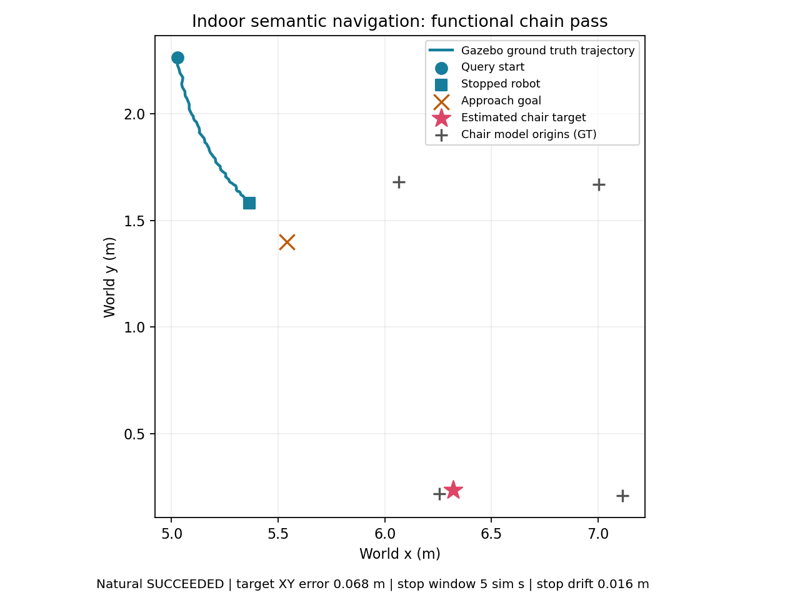

# 2026-10-03 Small House 室内仿真复验摘要

本目录用于在 GitHub 查看本轮代码修复的实际结果。共保留 **12 次尝试：1 次完整功能通过，
11 次失败**；第 11 次导航到达并停稳，但目标错误，仍计为失败。起点、参数和流程在调试中
变化，这些次数不构成匹配条件下的成功率或收益统计。

## 完整通过的用例

第 12 次输出目录为 `chair_kitchen_mapping_ground14`，运行的 manifest case 为
`chair_kitchen_mapping_pitch`。先低头补采真实地面、恢复水平，再查询 `chair`、导航和
观察停止；这是主动建图流程，与单纯静止预热后查询不同。

| 项目 | 实测结果 |
| --- | --- |
| 目标对应模型 | `ChairA_01_002`，最近同类模型原点 |
| 目标到模型原点 XY 误差 | **0.0684 m（6.8 cm）** |
| 目标 world XYZ | `(6.3214, 0.2363, 0.3245)` m |
| 接近点 world XYZ | `(5.5409, 1.3995, 0.0356)` m |
| 接近点到估计目标 XY 距离 | 1.4008 m |
| Nav2 结果 | 同一已接受 goal 自然返回 `SUCCEEDED` |
| 查询至自然成功 | 7.925 sim s / 17.525 wall s |
| 最终 GT 到 goal XY 距离 | **0.2541 m** |
| 成功后停止观察 | 5 sim s，44 个新最终控制样本 |
| 停止窗口内最大 GT 水平位移 | **0.0164 m** |
| 最终命令 | 线速度和角速度均为 0 |
| 定位最大对齐误差 | 0.0348 m |
| 本次仿真清理 | `remaining_owned_pids=[]`；12 次均为空 |

GT 为 Gazebo 模型原点与机器人真值，仅用于记录和验收，没有输入模型或导航选点。
6.8 cm 是目标到**模型原点的 XY 误差**，不是到椅子表面的距离。Nav2 使用定位估计
及原有 0.25 m 容差；真值验收使用原有 0.5 m 到 goal 上限，因此自然成功与 GT 0.2541 m
并不表示 Nav2 容差被放宽。

## 模型、流程与最终参数

- 场景：AWS Small House，资产源 commit `ff9631ca6d1db9c1ba656498151464b5ab74aafe`；
  Go2 / CHAMP、MID360、FAST-LIO、Nav2，独立 Gazebo 进程。
- 模型：`nvidia/segformer-b0-finetuned-ade-512-512`，ADE20K B0 revision
  `489d5cd81a0b59fab9b7ea758d3548ebe99677da`，本地离线 CUDA 推理，`indoor7`、完整 posterior。
- seed=7，名义起点 `(5.0, 2.4, -1.3)`（XY m / yaw rad），spawn height 0.35 m。
  启动后的实际静止姿态仍有差异，固定 seed 不保证严格配对。
- warmup 15 sim s；随后 3 sim s 渐变到机身 pitch +0.30 rad，保持 10 sim s，
  3 sim s 恢复，再观察至少 5 sim s。传感器固定安装外参不变；真实姿态达到并恢复后查询。
- 室内接近点使用地面高度筛选及机器人同侧约束：搜索半径 2.5 m，期望距离 1.4 m，
  实际距离下限 1.3 m；机器人参考高度 0.225 m，地面高度容差 0.1 m。
- 语义/不确定性点云按成功融合帧计数，最终发布步长为 1；室内线速度减速下限和
  unknown 比例为 0.65，角速度下限为 0.3。仍动态减速，零速和超时停车沿用原逻辑。
- 查询预算 90 sim s、墙钟上限 300 s；模型、识别门限和 Nav2 XY 容差 0.25 m 未放宽。
  停止要求新控制样本、末端线/角速度不超过 0.001 m/s、rad/s，GT 水平位移不超过 0.05 m。

最终流程定义见 [manifest](../../../config/benchmark/small_house_manifest.yaml)，
参数见 [室内配置](../../../config/semantic_mapping_sim_indoor.yaml)，
完整运行前提和复现步骤见 [室内 benchmark](../../INDOOR_GAZEBO_BENCHMARK.md)。

## 全部尝试

下列名称为本机批次的输出子目录。所有运行均独立启动，没有删除失败结果。
第 1—6 次点云步长为 3，第 7 次起为 1；第 11 次起线速度减速下限由 0.3 改为 0.65。

| 次数 / 输出目录 | 当次条件或改变 | 结果 |
| --- | --- | --- |
| 1 `chair_navigation` | 原厨房近处起点；四项时序修复 | 查询后 1.910 sim s 语义输出过期，未通过；据此修正融合发布计数 |
| 2 `chair_navigation_02` | 同名义起点；修正发布计数 | 90.025 sim s 内未形成目标簇，未通过；47 次语义输出，0 个目标/goal |
| 3 `chair_dining_southeast` | 已有东南侧起点 | 90 sim s 超时，最终 GT 距 goal 1.510 m，未自然到达 |
| 4 `chair_kitchen_facing` | 厨房朝向 -1.3 rad；期望距离 1.0 m | 目标误差 0.373 m；90 sim s 超时，GT 距 goal 0.324 m，末段停滞 |
| 5 `chair_kitchen_facing_standoff14` | 期望距离 1.4 m；允许另一侧选点 | 另一侧落点，实际距离 1.224 m；73.990 sim s 语义过期，GT 距 goal 1.381 m |
| 6 `chair_kitchen_facing_robot_side` | 增加机器人同侧约束 | 目标误差 0.093 m；实际距离仅 0.859 m，90 sim s 超时，GT 距 goal 0.325 m |
| 7 `chair_kitchen_facing_clearance` | 距离下限 1.3 m、期望 1.4 m；发布步长 1 | 实际距离 1.451 m；90.015 sim s 超时，GT 距 goal 0.397 m |
| 8 `chair_kitchen_facing_outside_dining` | 下限 1.8 m、期望 2.0 m、半径 2.5 m | 目标误差 0.078 m，但生成较晚；90 sim s 超时，GT 距 goal 2.469 m |
| 9 `chair_kitchen_wide` | 已有较远厨房起点，其余同第 8 次 | 目标原点误差 2.260 m，超过既有 1.5 m 上限；90 sim s 超时，错目标 |
| 10 `chair_kitchen_mapping_pitch` | 增加低头建图与地面高度筛选；减速下限 0.3 | 真实 pitch 达成并恢复；goal z=0.034 m，目标误差 0.674 m；90 sim s 超时，GT 距 goal 0.471 m |
| 11 `chair_kitchen_mapping_gait65` | 同流程；减速下限 0.65，站位下限仍 1.8 m | 自然 `SUCCEEDED`（54.815 sim s）且停稳通过，GT 距 goal 0.193 m；**目标误差 5.981 m，完整用例失败** |
| 12 `chair_kitchen_mapping_ground14` | 同流程；期望 1.4 m、下限 1.3 m、减速下限 0.65 | **完整通过**；目标误差 0.0684 m，自然 `SUCCEEDED`，GT 距 goal 0.2541 m，停稳通过 |

机器可读的原始指标摘录见 [summary.json](summary.json)。第 11 次的规划尾点到 goal
距离为 0，不能将该次结果归因于规划器终点回退；到达错误的目标也不算功能成功。

## 修复与验证

修复了导航桥在暂停仿真时钟下的超时检查、时钟回跳后的同步与 IMU 缓存、落后剪枝时
重复老化、CARLA 六张评估地图的统一终点老化，以及 TF 丢帧消耗发布编号的问题。
实际仿真进一步暴露 MID360 静止时近处地面盲区，最终通过既有 CHAMP 姿态接口补采地面，
使用地面高度与同侧选点，并调整室内减速下限以适应 Go2 仿真步态。

完整测试首轮为 467 passed、1 failed（新增测试续行缩进），该项修正后复验通过；
后续发布节奏回归为 76 passed。累计 469 项最终通过，包含本地 ADE20K 实际推理及
ROS 传输；这是首轮与相关复验合计，未声称单次 469 项零失败。后续地面选点、建图、
控制和配置分别完成 45、54、11 项相关检查，主包最终重建退出 0。文档链接和
`git diff --check` 通过。原始日志保留首次失败及其后复验。

本次证明该椅子用例的功能可行性。当前投影尚无几何遮挡过滤，远处表面可能继承前景
chair 像素；第 9、11 次已出现错目标。该原因有代码依据，但尚无同帧图像/点云的直接
遮挡验证。floor 类别本身也不证明整机净空，当前仿真 RPP 碰撞 veto 关闭。
正式重复成功率、碰撞率、有效接近点、SPL、融合收益和主动减速对照均未统计；没有
宣称任意起点或类别可靠，也没有做实机验收。Lite3 的未标定与禁止运动状态保持不变。

## 原始证据位置

代码基线为主仓库 `main` 的 `ecbb89d87a69a54da9bef53f8581aa1eb5ef4d10`
加本轮工作树；这标识试验时的源码基线，不是发布后的新提交号。
完整批次位于原 Linux 工作区：
`/home/yk/ws/indoor_benchmark_runs/aws_small_house/20261003_timing_fixes/`。
该目录保存批次 README、全部 12 个 `result.json`、进程日志、测试/构建日志及当次参数快照。
本公开摘要仅复制指标摘录和既有轨迹图，不上传大体积原始轨迹、日志或 ROS Bag，不能代替
原始数据复算；日志本身也不等同于传感器 Bag。
