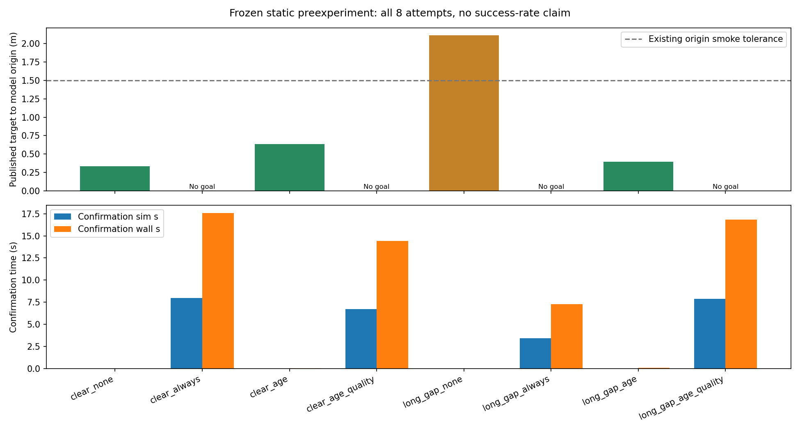
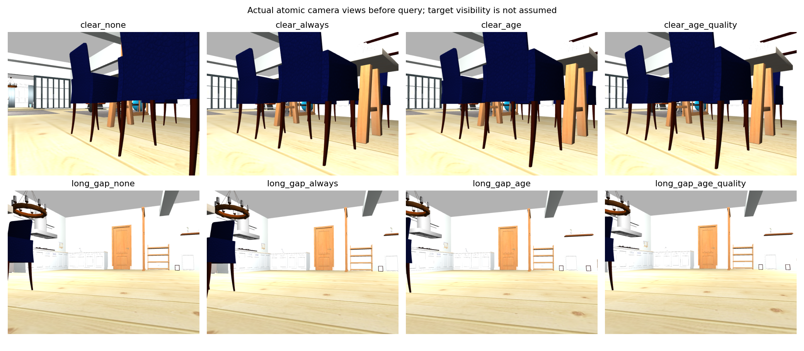

# 2026-10-07 静态候选确认预实验摘要

本目录保存可在 GitHub 查阅的指标与图表。原始试验由 `9d405b4` 加各阶段工作树执行；发布版本还包含后续短输入空档修复与默认策略调整，不能把原八臂当作最终提交的独立精确复跑。

## 实现与配置

- 新接纳源的正有效注入刷新有效观察时间；重复、拒绝、零注入不刷新，饱和仍有效，时钟重启后记未知。
- 候选使用80%支持年龄、新鲜支持比例及区域新证据；预算在候选间累计，未知深度不能完成确认。
- Static Small House / Go2，家具未移动；不衰减、TTL=0、每体素总浓度200、每源点支持上限3、32源记录。
- 两个视角四臂：none、always、age、age_quality；冻结30 sim s/90 wall s确认预算、10源、两候选、每候选12 sim s；接受至少2有效源、.5新注入、.5覆盖、.4类别支持且目标为主类。
- 长空窗程序先低头建图，实际前进约.4m、转离约120°、停75 sim s、转回朝向后查询；回到朝向不代表回到原位置。
- GT不进入预测、候选、确认或策略指令，只作独立验收和无效试验中止。

比较时的[室内配置](protocol/semantic_mapping_sim_indoor.yaml)、[manifest](protocol/small_house_manifest.yaml)和[当时确认口径](protocol/STATIC_CONFIRMATION.md)保留在protocol。当前默认age及短输入空档处理见[当前方法](../../STATIC_CONFIRMATION.md)和[运行说明](../../RUNBOOK.md)。

## 所有八臂结果

| 用例/策略 | 结果 | 确认sim/wall秒 | 尝试源 | 目标原点XY米 | 停止验收 |
|---|---|---:|---:|---:|---|
| `clear_none_01` | 到达停稳 | 0.00/0.00 | 0 | 0.333 | 通过 |
| `clear_always_01` | 未确认 | 7.97/17.56 | 10 | — | 通过 |
| `clear_age_01` | 到达停稳 | 0.00/0.04 | 0 | 0.637 | 通过 |
| `clear_age_quality_01` | 未确认 | 6.73/14.41 | 10 | — | 通过 |
| `long_gap_none_01` | 导航未通过 | 0.00/0.00 | 0 | 2.109 | 未完成 |
| `long_gap_always_01` | 输入失效 | 3.42/7.26 | 1 | — | 通过 |
| `long_gap_age_01` | 到达停稳 | 0.00/0.09 | 0 | 0.398 | 通过 |
| `long_gap_age_quality_01` | 未确认 | 7.86/16.82 | 10 | — | 通过 |

3次到达停稳、3次未确认、1次输入失效、1次导航未通过；7次完成同口径停止验收。各臂只运行一次、初始地图也未完全一致，不能作为正式成功率或收益统计。两个age臂的候选年龄.5/8.705s，直接沿用新鲜候选；所有八臂新增确认均为false，没有验证主动复查成功放行。

长空窗none发布目标后原点误差2.109m，90 sim s内没有自然导航终态，停稳未验收。age_quality长空窗新类别支持.716、覆盖.470、当前新区域深度支持.269，未满足确认条件。预算未确认不表示目标不存在。所有试验自己启动的进程最终均已清理。

[CSV](summary.csv)和[JSON](summary.json)分列候选评估数、实际复查次数、源数、确认和任务耗时；none旧接近候选尝试数未采集。模型原点、视觉中心和表面距离分别保存；几何绑定为部分代理，不能宣称严格同实例纠错、完整误差归因或校准收益。

## 调试与后续修复

另外保留3次参数/区域统计调试与1次短空档修复复验，总计12次真实尝试。前三次不混入八臂对照。八臂后将短暂融合陈旧改为先停转向、原预算内等恢复，已确认状态须再有正有效源才可放行；TF不可用和真实时钟重启仍终止。

单独修复复验仍未确认：10尝试源、4有效源，类别支持.757、覆盖.632、深度支持.267；5 sim s停稳最大漂移.0206m，最终零速。该次未触发等待/恢复分支，因此该分支只有定向回归证据，不声称修复改善成功率。

本轮235项相关检查最终通过（232沙箱内、3本机进程/通信），真实ROS创建/退出和主包构建通过；这些不是反馈效果或实机验收。Nav2执行失败后自动换候选、完整恢复、碰撞率与重复成功率仍待验证。

## 完整本机证据

原始数据位置：`/home/yk/ws/indoor_benchmark_runs/aws_small_house/20261007_static_confirmation/`，含12次result.json、完整fusion_trace、运行URDF、日志、源码和配置快照、部分几何归因叠图。这里的轻量摘要不能替代原始输入复算，不包含大型日志或传感器Bag。
